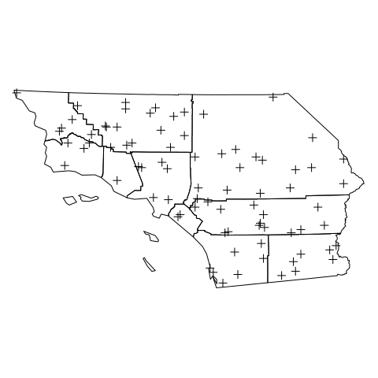
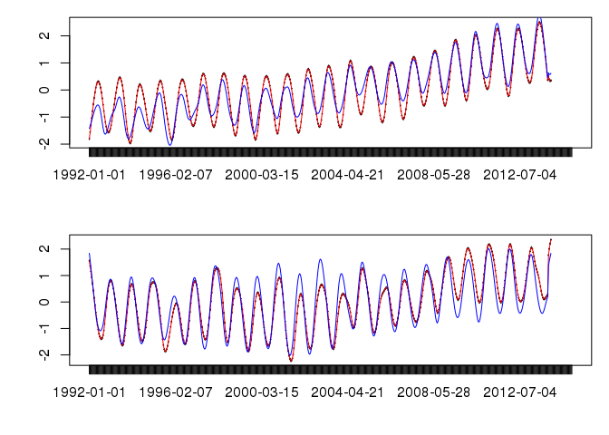
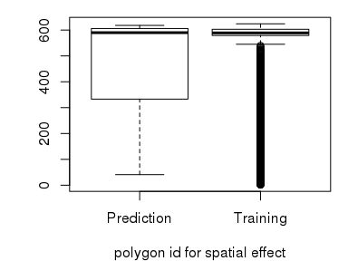
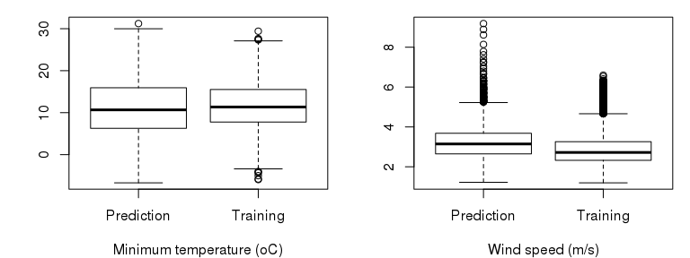
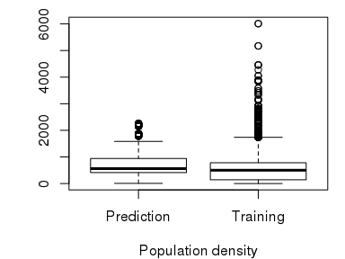
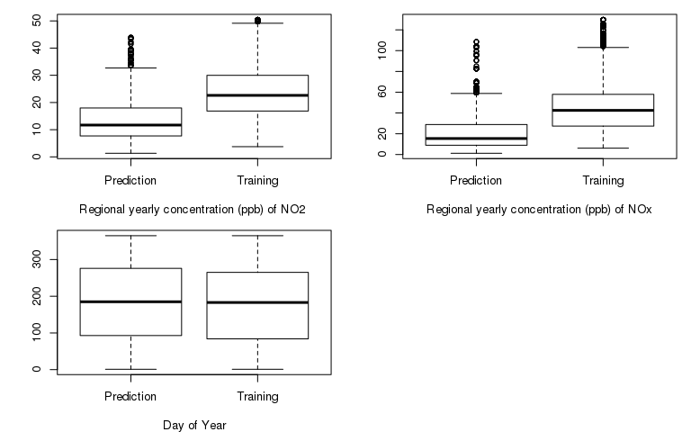

Ensemble Spatiotemporal Mixed Models for Exposure Estimation of Air Pollutants
================

sptemUS: a special R package for spatiotemporal exposure estimation
-------------------------------------------------------------------

It is an ensemble spatiotemporal mixed modeling tool with constrained optimizationand with support of parallel computing. The package can access the server to employ the trained models to make predictions based on the user's prediction dataset. The current models are based on the ones trained using the data and approach in our published paper, ***Constrained Mixed-Effect Models with Ensemble Learning for Prediction of Nitrogen Oxides Concentrations at High Spatiotemporal Resolution***, published in EST (2017) (<doi:10.1021/acs.est.7b01864>). The model and the training data are hiden from the users for the data security purpose.

Specifically, it includes the following functionalities:

-   Extracting meteorological parameters from the US continential grids dataset on the server;
-   Extracting Thiessen's polygon id for spatial effect models using the models trained on the server;
-   Extracting the yearly means based on the configuration of Thiesseon polygons based on the data on the server;
-   Parallel predictions using python to call the functions on the server side;
-   Constrained optimization to adjust the estimated concentrations.

In the following, we will provide a example with locations in California to illustrate the functionalities. The example is not a true example and its traffic and population covariates were generated randomly but the meteorological parameters, Thiesseon polygons and yearly concentration were generated using the training dataset. The users can't access the trained dataset and models but can use the models to make the predictions for NO2 and NOx concentrations. It serves the purpose of illustrating how to use the package.

### Installation

You can instal this package using R as follows:

***Step 1*** Install R (version: &gt;=3.3) (<https://cran.r-project.org/>);

***Step 2*** For the windows users, the Rtools are required to be installed (<https://cran.r-project.org/bin/windows/Rtools/>);

***Step 3*** Install devtools package in the R system: install.package(“devtools”);

***Step 4*** Install this package: devtools::install\_github("lspatial/sptemUS").

### Load of the library

After this package's installation, load the library using the following command:

``` r
library(sptemUS)
```

### Load of the sample dataset

After this package's installation, load the sample dataset stored in the package using the following functions:

``` r
data("sc_sample","sc_sample_loc","scamap_p")
par(mar=c(0,0,0,0))
raster::plot(scamap_p)
raster::plot(sc_sample_loc,add=T)
```



The sc\_sample data is the prediction sample dataset and sc\_sample\_loc is a SpatialPointDataFrame to store the location information of the data, sc\_sample. scamap\_p is the map of the counties for southern California.

### Generation and extration of the meteorological parameters

Use the following functions to generate the biweekly averages for the target locations covering the study period, 1992-2013 and it will take some time since the result will cover all the biweekly time slices of the study period (01/01/1992 to 12/31/2013).

For the minimum air temperature:

genBiweekMeteos(sc\_sample\_loc,tarVar="tmmn",dname="air\_temperature",subgid="gid",flag="sc\_sample", from\_biwk=1,to\_biwk=574, start\_date="1992-01-01" )

For the wind speed:

genBiweekMeteos(sc\_sample\_loc,tarVar="vs",dname="wind\_speed",subgid="gid",flag="sc\_sample", from\_biwk=1,to\_biwk=574, start\_date="1992-01-01" )

The generated results will be saved on the server side for later access.

Using the following functions to access the meteorological parameters for the locaiton-specific and time-specific individuals:

``` r
#Air temperature: 
sc_sample$tmmn=extractBiweekMegteos(dfInput=sc_sample,nVar="tmmn",flag="sc_sample",from_biwk=1,
                               to_biwk=574,subgid="gid")
sc_sample$tmmn=sc_sample$tmmn-273.15

#Wind speed 
sc_sample$wnd=extractBiweekMegteos(dfInput=sc_sample,nVar="vs",flag="sc_sample",from_biwk=1,
                              to_biwk=574,subgid="gid")
print(head(sc_sample[,c("gid","biweekid","tmmn","wnd")],n=10))
```

    ##      gid biweekid      tmmn      wnd
    ## 1  19229       74 13.045842 1.913433
    ## 2  19229      333 18.224050 2.638147
    ## 3  19229      351 20.920456 3.526863
    ## 4  19229      479 15.409392 4.076084
    ## 5  19229      172 28.585785 2.832611
    ## 6  19229      173 27.954791 3.829362
    ## 7  19229      446  6.422274 3.666248
    ## 8  19229      365  4.299716 2.764088
    ## 9  19229      314  3.551523 2.813271
    ## 10 19229       85  8.219243 3.491237

### Assignment of the Thiessen polygons and yearly means of NO2 and NOx concentration by spatial overlay operation

This step is to assign the Thiessen polygon gid and monthly mean of NO2 and NOx concentration to the point for spatial effect modeling.

***Step 1*** Thiess polygon's id

``` r
sc_sample_p=sc_sample
index=match(sc_sample_p$gid,sc_sample_loc$gid)
sp::coordinates(sc_sample_p)=sp::coordinates(sc_sample_loc[index,])
sp::proj4string(sc_sample_p)=sp::proj4string(sc_sample_loc)

sc_sample$rid500m=getRidbytpolyFlag(tFlag="sc_sample",tpolyFl="sp_polys_500m_sel",sc_sample_p)
sc_sample_p$rid500m=sc_sample$rid500m
```

***Step 2*** Monthly concentration of NO2 and NOx

``` r
sc_sample_p$year=as.integer(format(sc_sample$s_date,"%Y"))
sc_sample$ymean_no2=getPolyYMeanFlag(tFlag="sc_sample",tpolyFl="aqs_added_sites_no2_poly",biweekAvFl="aqs_added_biweek_no2_yly",
                                     pntlayer=sc_sample_p,ridF="rid",siteid="ID2",yearF="year")

sc_sample$ymean_nox=getPolyYMeanFlag(tFlag="sc_sample",tpolyFl="aqs_added_sites_nox_poly",biweekAvFl="aqs_added_biweek_nox_yly",
                                     pntlayer=sc_sample_p,ridF="rid",siteid="ID2",yearF="year")
```

The sample result is shown:

``` r
print(head(sc_sample[,c("gid","biweekid","rid500m","ymean_no2","ymean_nox")],n=10))
```

    ##      gid biweekid rid500m ymean_no2 ymean_nox
    ## 1  19229       74     610  6.524141  8.518312
    ## 2  19229      333     610  6.301949  6.593156
    ## 3  19229      351     610  6.682231  6.952746
    ## 4  19229      479     610  4.929992  4.647982
    ## 5  19229      172     610  6.855511  7.997039
    ## 6  19229      173     610  6.855511  7.997039
    ## 7  19229      446     610  5.312924  5.129876
    ## 8  19229      365     610  6.682231  6.952746
    ## 9  19229      314     610  6.943845  7.918018
    ## 10 19229       85     610  6.616535  8.623411

### Merging the temporal basis with the primary prediction dataset

This step is to get the temporal basis function as the predictors in the primary prediction dataset.

``` r
sc_sample_m=getTimeSeriesFlag(tFlag="sc_sample",tbasisFl="temporalbasis_ext",
                                 sublocs=sc_sample,biweekid="biweekid")
sc_sample_m$s_date.x=NULL
colnames(sc_sample_m)[which(colnames(sc_sample_m)=="s_date.y")]="s_date"

colnames(sc_sample_m)[which(colnames(sc_sample_m)=="no2V1")]="stbasis_no2_1"
colnames(sc_sample_m)[which(colnames(sc_sample_m)=="no2V2")]="stbasis_no2_2"
colnames(sc_sample_m)[which(colnames(sc_sample_m)=="noxV1")]="stbasis_nox_1"
colnames(sc_sample_m)[which(colnames(sc_sample_m)=="noxV2")]="stbasis_nox_2"

par(mfrow=c(2,1),mar=c(4,4,1,1))
plot(sc_sample_m$s_date,sc_sample_m$stbasis_nox_1,col="red",type="l")
lines(sc_sample_m$s_date,sc_sample_m$stbasis_nox_1,col="red")
lines(sc_sample_m$s_date,sc_sample_m$stbasis_no2_1,col="blue")

plot(sc_sample_m$s_date,sc_sample_m$stbasis_nox_2,col="red",type="l")
lines(sc_sample_m$s_date,sc_sample_m$stbasis_nox_2,col="red")
lines(sc_sample_m$s_date,sc_sample_m$stbasis_no2_2,col="blue")
```



### Check of consistency for the prediction dataset and the training dataset

This step is to check the the consistency for the prediction dataset and the training dataset using the boxplot for value range and basic distribution. We assume that you already generated the traffic and population density covariates. We call the function, getTrainCov to access the server to get the covariate of the training dataset (the covariate shuffled randomly for security purpose).

First, check the regional id of Thiessen polygons to be used in spatial effect modeling:

``` r
par(mar=c(4,4,1,1))
acov="rid500m";xlab="polygon id for spatial effect"
tr_acov=getTrainCov("sc_sample",acov)
boxplot(sc_sample[,acov],tr_acov,names=c("Prediction","Training"),xlab=xlab)
```



Second, check the traffic covariates: dist\_fcc1: shortest distance to FCC1; cl\_freewaynox: CALINE4 output on freeways; cl\_nonfreewaynox: CALINE4 output on non-freeways; trdenscaled300\_5km\_r: difference in traffic density between the buffering distances of 300 m and 5 km;

``` r
par(mar=c(4,4,1,1),mfrow=c(2,2))
acov="dist_fcc1"; xlab="Distance to freeways (m)"
tr_acov=getTrainCov("sc_sample",acov)
boxplot(sc_sample[,acov],tr_acov,names=c("Prediction","Training"),xlab=xlab)

acov="cl_freewaynox"; xlab="Caline4 NOx (ppb) on freeways"
tr_acov=getTrainCov("sc_sample",acov)
boxplot(sc_sample[,acov],tr_acov,names=c("Prediction","Training"),xlab=xlab)

acov="cl_nonfreewaynox"; xlab="Caline4 NOx (ppb) on non-freeways"
tr_acov=getTrainCov("sc_sample",acov)
boxplot(sc_sample[,acov],tr_acov,names=c("Prediction","Training"),xlab=xlab)


acov="trdenscaled300_5km_r"; xlab="Traffic density (300m-5km)"
tr_acov=getTrainCov("sc_sample",acov)
boxplot(sc_sample[,acov],tr_acov,names=c("Prediction","Training"),xlab=xlab)
```


Third, check the covariates of meteorological parameters (minimum air temperature and wind speed):

``` r
par(mar=c(4,4,1,1),mfrow=c(1,2)) 
acov="min_temp";xlab="Minimum temperature (oC)"
colnames(sc_sample)[which(colnames(sc_sample)=="tmmn")]=acov
tr_acov=getTrainCov("sc_sample",acov)
boxplot(sc_sample[,acov],tr_acov,names=c("Prediction","Training"),xlab=xlab)

acov="winsp";xlab="Wind speed (m/s)"
colnames(sc_sample)[which(colnames(sc_sample)=="wnd")]=acov
tr_acov=getTrainCov("sc_sample",acov)
boxplot(sc_sample[,acov],tr_acov,names=c("Prediction","Training"),xlab=xlab)
```

 Fourth, check the covariates of population density (within the buffer distance of 300 m):

``` r
par(mar=c(4,4,1,1)) 
acov="popd";xlab="Population density"
tr_acov=getTrainCov("sc_sample",acov)
boxplot(sc_sample[,acov],tr_acov,names=c("Prediction","Training"),xlab=xlab)
```



Fifth, check the covariates of regional yearly concentration and day of year and change the column names to be consistent with the trained dataset:

``` r
par(mar=c(4,4,1,1),mfrow=c(2,2)) 
acov="aqs_add_no2_y";xlab="Regional yearly concentration (ppb) of NO2 "
colnames(sc_sample)[which(colnames(sc_sample)=="ymean_no2")]=acov
tr_acov=getTrainCov("sc_sample",acov)
boxplot(sc_sample[,acov],tr_acov,names=c("Prediction","Training"),xlab=xlab)

acov="aqs_add_nox_y";xlab="Regional yearly concentration (ppb) of NOx"
colnames(sc_sample)[which(colnames(sc_sample)=="ymean_nox")]=acov
tr_acov=getTrainCov("sc_sample",acov)
boxplot(sc_sample[,acov],tr_acov,names=c("Prediction","Training"),xlab=xlab)

acov="yeard";xlab="Day of Year"
sc_sample[,acov]=lubridate::yday(sc_sample$s_date)
tr_acov=getTrainCov("sc_sample",acov)
boxplot(sc_sample[,acov],tr_acov,names=c("Prediction","Training"),xlab=xlab)
```



For the consistency check, if inconsistency is found in terms of value range or distribution, the reason should be found and corrected to avoid possible errors like scaling, unit difference and other errors. Thus, the prediction functions can work normally.

### Check of missing covariate values for the prediction dataset

This step is to check the possible missing vaues. All the record with any missing value of the covariate should be removed so as to make the prediction fucntion work normally.

``` r
sc_sample_sub=sc_sample_m
colnames=c('dist_fcc1','min_temp', 'winsp', 'popd','cl_freewaynox','cl_nonfreewaynox', 'rid500m',
           'aqs_add_no2_y', 'aqs_add_nox_y','stbasis_no2_1','stbasis_no2_2','stbasis_nox_1','stbasis_nox_2',
           'trdenscaled300_5km_r')

exp="sc_sample_sub[which("
for(i in c(1:length(colnames))){
  acol=colnames[i]
  exp=paste(exp,"!is.na(sc_sample_sub[,'",acol,"'])",sep="")
  if(i<length(colnames)){
    exp=paste(exp," & ",sep="")
  }
}
exp=paste(exp,"),]",sep="")
sc_sample_sub=eval(parse(text=exp))
print(paste(nrow(sc_sample_m)," before missing values removed",sep=""))
```

    ## [1] "7439 before missing values removed"

``` r
print(paste(nrow(sc_sample_sub)," after missing values removed",sep=""))
```

    ## [1] "7439 after missing values removed"

### Parallel prediction on the server side

There are three steps for the parallel predictions on the server side:

***Step 1*** Predicitons of the multiple models (120 models now) trained with the outputs stored on the server side. You can setup the number of number and cores (better to use the default) to be used. Here we just setup the number of the models to be 5 for illustration purpose. ALthough the call function returns quickly, please wait for a while for the server to generate the results and then continue next step

``` r
no2_ens=pyparpredict(sc_sample_sub,'no2',flag='sc_sample_no2',nModel=10,ncore=5,idF="gid")
```

    ## [1] "Duty submitted successfully! Please wait for a while to retrieve the results... ...!"

``` r
nox_ens=pyparpredict(sc_sample_sub,'nox',flag='sc_sample_nox',nModel=10,ncore=5,idF="gid")
```

    ## [1] "Duty submitted successfully! Please wait for a while to retrieve the results... ...!"

***Step 2*** Weighetd averages based on the multiple predictions stored on the server.

``` r
weivno2=weiA2EnsFlag(flag="sc_sample_no2",pol="no2",preF="preno2",idF="gid",dateF="s_date")
weivnox=weiA2EnsFlag(flag="sc_sample_nox",pol="nox",preF="prenox",idF="gid",dateF="s_date")
```

***Step 3*** Data merging

``` r
index=match(interaction(weivno2$id,weivno2$date),interaction(weivnox$id,weivnox$date))
merged_no2x=data.frame(gid=weivno2$id,s_date=weivno2$date)
merged_no2x$no2_m=weivno2$mean
merged_no2x$no2_sd=weivno2$StandardDev
merged_no2x$nox_m=weivnox[index,"mean"]
merged_no2x$nox_sd=weivnox[index,"StandardDev"]
print(range(merged_no2x$nox_m,na.rm=TRUE))
```

    ## [1]   2.317773 298.564339

``` r
print(range(merged_no2x$no2_m,na.rm=TRUE))
```

    ## [1]  2.078587 75.031117

### Constrained optimization

The constrained optimization can be used based on the merged dataset to get the adjusted values. We can put the original point estimates and the adjusted long-term time series to check the results.

``` r
par(mar=c(4,4,1,1))
data(merged_no2x)
no2x_season_trends=getTSeries(flag="sc_sample")
no2x_season_trends$s_date=as.Date(no2x_season_trends$s_date)
merged_no2x$gid=as.integer(merged_no2x$gid)

# Check the time seires for the geo id, 30314
agid=30314
tt=merged_no2x[merged_no2x$gid==agid,]
asiteDt=tt
asiteDt$s_date=as.Date(asiteDt$s_date)
asiteDt$biweekid=(asiteDt$s_date-as.Date("1992-01-01"))/14+1

tseriesNO2Obj=conOptNo2(no2x_season_trends,asiteDt,predId="no2_m")
tseries_no2=tseriesNO2Obj$series
tseries_no2$biweekid=(as.Date(tseries_no2$start_date)-as.Date("1992-01-01"))/14+1
tseriesNOxObj=conOptNox(no2x_season_trends,asiteDt,tseries_no2,predId="nox_m")
tseries_nox=tseriesNOxObj$series
tseries_nox$biweekid=(as.Date(tseries_nox$start_date)-as.Date("1992-01-01"))/14+1

tseries_no2=tseries_no2[which(is.finite(tseries_no2$sim)),]
tseries_nox=tseries_nox[which(is.finite(tseries_nox$sim)),]
plot(tseries_nox$start_date,tseries_nox$sim,ylim=c(min(tseries_no2$sim,asiteDt$no2_m)-5,
                                                   max(tseries_nox$sim,asiteDt$nox_m)+5),
     type="l",xlab="Date",ylab="NOx (ppb)", col="red")
lines(tseries_no2$start_date,tseries_no2$sim, type="l",xlab="Date",ylab="NO2 (ppb)", col="blue")
points(asiteDt$s_date,asiteDt$nox_m,col="red")
points(asiteDt$s_date,asiteDt$no2_m,col="blue")
legend(x=as.Date("2010-08-01"),y=max(tseries_nox$sim,asiteDt$nox_m)+4, cex=1,legend=c("Original NOx estimate",
      "Adjusted NOx series","Original NO2 estimate","Adjusted NO2 series"),
       bty="n",lty=c(NA,1,NA,1),pch=c(1,NA,1,NA),col=c("red","red","blue","blue"))
```


We can calculate the correlation between the original point estimates and adjusted estimates by constrained optimization.

``` r
allSubs_no2x=merged_no2x
allSubs_no2x$s_date=as.Date(allSubs_no2x$s_date)
allSubs_no2x$biweekid=(allSubs_no2x$s_date-as.Date("1992-01-01"))/14+1

allSubs_no2x$intgeoid2biweekid=interaction(allSubs_no2x$gid,allSubs_no2x$biweekid)
sites=unique(allSubs_no2x$gid)
sites=sites[order(sites)]
allSubs_no2x[,"preno2MAdj"]=NA
allSubs_no2x[,"prenoxMAdj"]=NA
mFrom=1 ;mTo=length(sites)
for(i in c(mFrom:mTo)){ # i=1
  asite=sites[i] # asite=167     # asite=1218
  tt=allSubs_no2x[allSubs_no2x$gid==as.numeric(asite),]
  asiteDt=tt
  asiteDt$date=as.Date(asiteDt$s_date)
  asiteDt$start_date=asiteDt$date

  tseriesNO2Obj=conOptNo2(no2x_season_trends,asiteDt,predId="no2_m")
  tseries_no2=tseriesNO2Obj$series
  tseries_no2$biweekid=(as.Date(tseries_no2$start_date)-as.Date("1992-01-01"))/14+1
  tseriesNOxObj=conOptNox(no2x_season_trends,asiteDt,tseries_no2,predId="nox_m")
  tseries_nox=tseriesNOxObj$series
  tseries_nox$biweekid=(as.Date(tseries_nox$start_date)-as.Date("1992-01-01"))/14+1

  #get index to link the constrained optimization output (exposure assignments) with the subject data
  sIndex=match(allSubs_no2x$intgeoid2biweekid,interaction(asite,tseries_no2$biweekid))
  allSubs_no2x[,"preno2MAdj"]=ifelse(is.na(allSubs_no2x[,"preno2MAdj"]),tseries_no2[sIndex,"sim"],
                                     allSubs_no2x[,"preno2MAdj"])

  sIndex=match(allSubs_no2x$intgeoid2biweekid,interaction(asite,tseries_nox$biweekid))
  allSubs_no2x[,"prenoxMAdj"]=ifelse(is.na(allSubs_no2x[,"prenoxMAdj"]),tseries_nox[sIndex,"sim"],
                                     allSubs_no2x[,"prenoxMAdj"])
}
cor.test(allSubs_no2x$no2_m,allSubs_no2x$preno2MAdj)
```

    ## 
    ##  Pearson's product-moment correlation
    ## 
    ## data:  allSubs_no2x$no2_m and allSubs_no2x$preno2MAdj
    ## t = 248.42, df = 5665, p-value < 2.2e-16
    ## alternative hypothesis: true correlation is not equal to 0
    ## 95 percent confidence interval:
    ##  0.954793 0.959174
    ## sample estimates:
    ##       cor 
    ## 0.9570381

``` r
cor.test(allSubs_no2x$nox_m,allSubs_no2x$prenoxMAdj)
```

    ## 
    ##  Pearson's product-moment correlation
    ## 
    ## data:  allSubs_no2x$nox_m and allSubs_no2x$prenoxMAdj
    ## t = 277.19, df = 5665, p-value < 2.2e-16
    ## alternative hypothesis: true correlation is not equal to 0
    ## 95 percent confidence interval:
    ##  0.9632207 0.9667988
    ## sample estimates:
    ##       cor 
    ## 0.9650547
